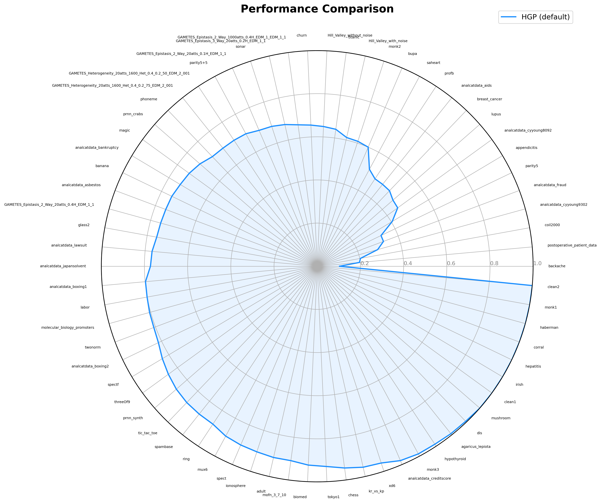
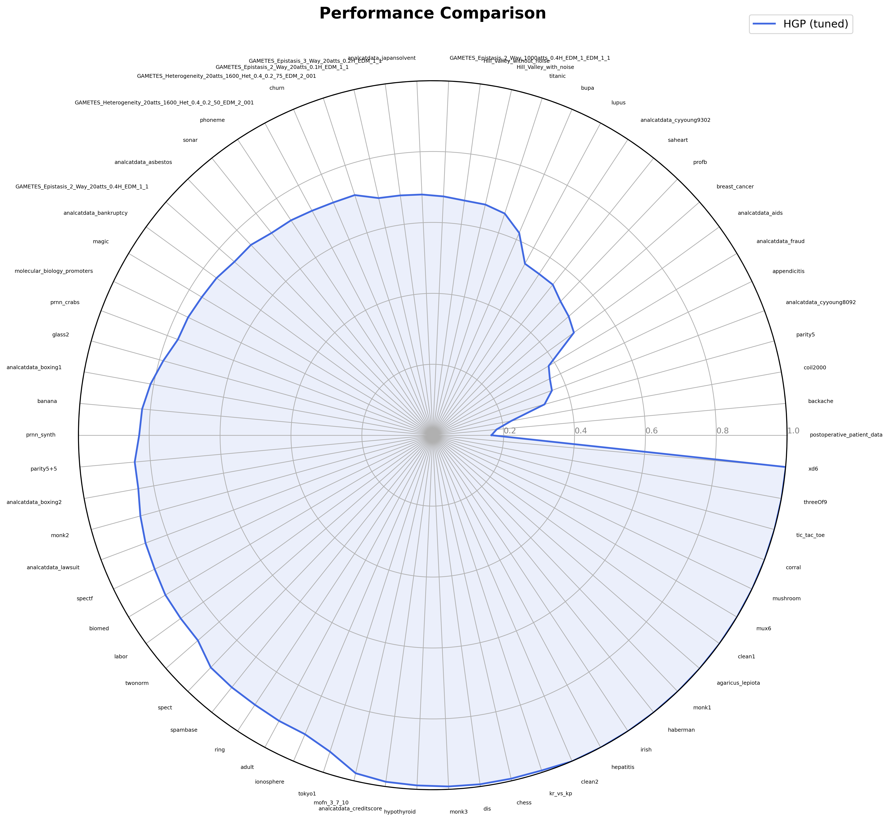
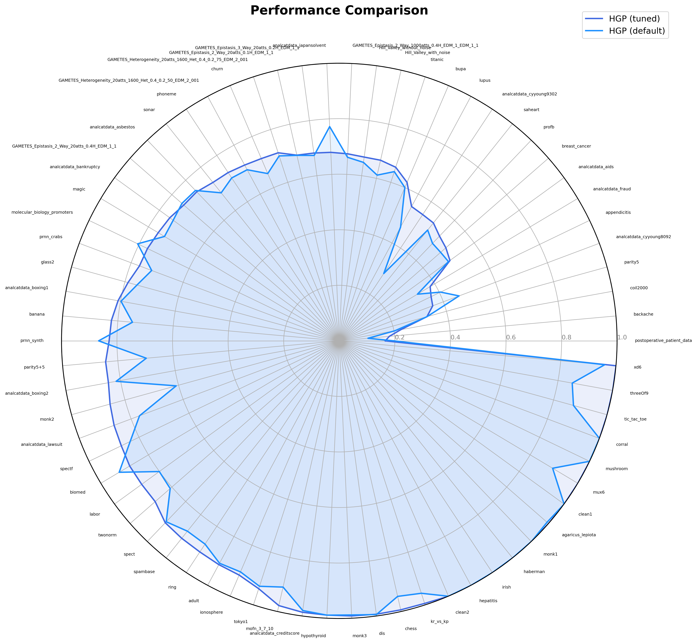
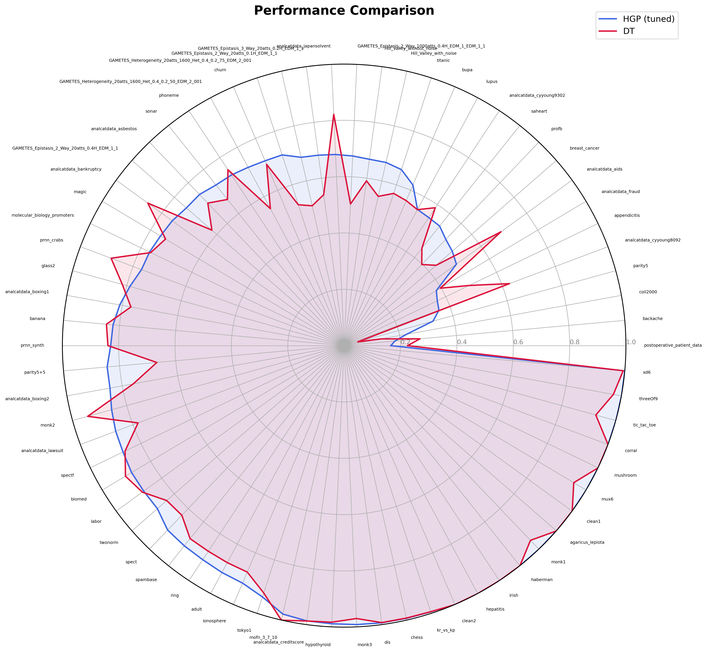
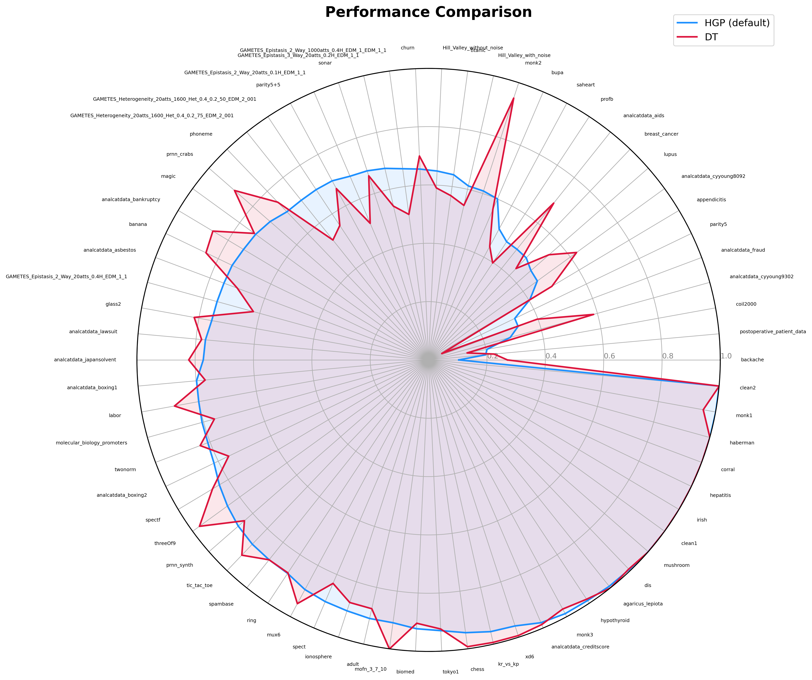
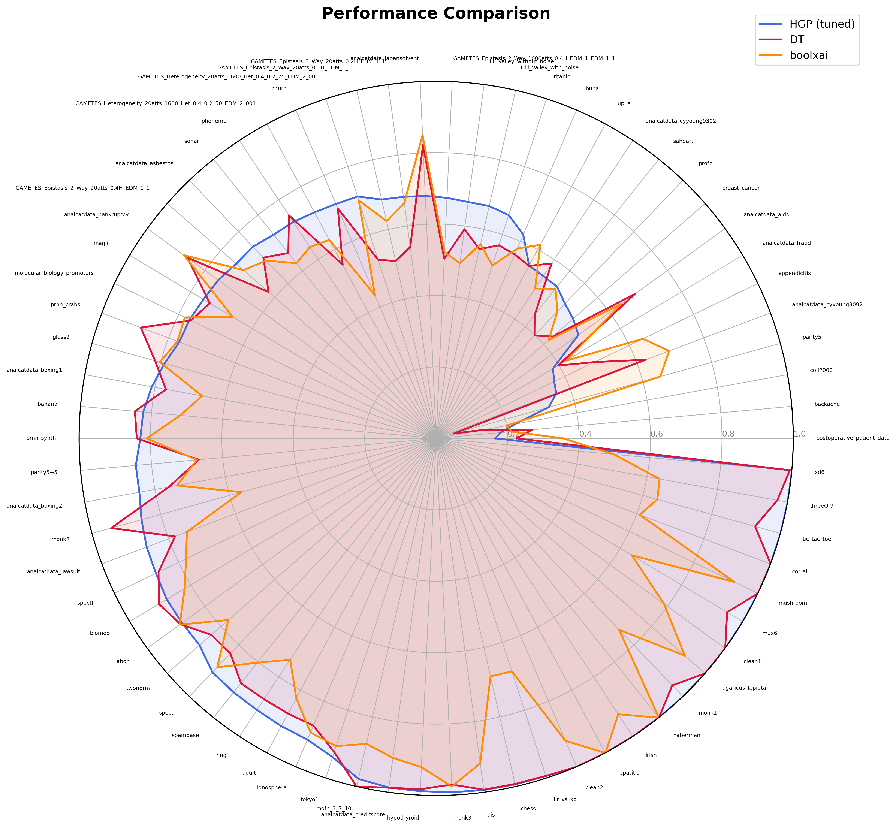

# PMLB

The [Penn Machine Learning Benchmarks](https://github.com/EpistasisLab/pmlb) (PMLB) is a curated collection of benchmark datasets for evaluating machine learning methods.
HGP is evaluated on the binary classification datasets in the suite.

## Data preparation

The preprocessing script lives at [`scripts/preprocess/pmlb_preprocess.py`](https://github.com/fii-optim-lab/hgp-lib/blob/master/scripts/preprocess/pmlb_preprocess.py).
It fetches a named dataset with the `pmlb` package and writes it to the data folder as an HDF file.

```bash
python scripts/preprocess/pmlb_preprocess.py breast_cancer --data_path data
```

This writes `data/breast_cancer.hdf`.

The list of binary classification datasets comes from the PMLB summary table.
The same query is used by the batch runner to decide which datasets to process.

```python
from pmlb.dataset_lists import df_summary

binary_datasets = df_summary[df_summary["n_classes"] == 2.0]["dataset"].tolist()
```

!!! warning
    Some datasets listed in older PMLB summaries are no longer available, because they were removed as duplicates.
    Fetching such a dataset raises an error.
    Skip the missing datasets and continue with the rest.

## Running a benchmark

Benchmark the Boolean GP on a single preprocessed dataset with `scripts/run_benchmark.py`.

```bash
python scripts/run_benchmark.py --data_path data/breast_cancer.hdf
```

See `python scripts/run_benchmark.py --help` for the full list of options.

## Hyperparameter tuning

Tune a single dataset with the Optuna script.
The study name keeps trials grouped, and artifacts are written to the artifact directory.

```bash
python scripts/optuna_hypertuning.py \
    --data_path data/breast_cancer.hdf \
    --study_name pmlb_breast_cancer \
    --n_trials 25 \
    --max_n_trials 25 \
    --n_runs 5 \
    --n_folds 3 \
    --artifact_dir ./artifacts
```

## Running on all datasets

The [`scripts/run_on_pmlb.py`](https://github.com/fii-optim-lab/hgp-lib/blob/master/scripts/run_on_pmlb.py) script runs the Optuna tuning across every binary classification dataset.
It fetches the dataset names, builds one `optuna_hypertuning.py` command per dataset, and runs them in parallel.

```bash
python scripts/run_on_pmlb.py --n_jobs 4
```

The `--n_jobs` argument sets how many datasets are processed at the same time.
Preprocessing is not required beforehand.
When a dataset file is missing, `optuna_hypertuning.py` downloads it from PMLB and writes the HDF file before tuning.

## Results on PMLB

This case study evaluates HGP on 70 binary classification datasets from PMLB.
We compare two HGP variants against two interpretable baselines.

The HGP variants are:

- HGP (default): run with `run_on_pmlb.py --model gp_default --num_epochs 10000`, using the library defaults.
- HGP (tuned): run with `run_on_pmlb.py --model gp_tuned`, which tunes each dataset with the Optuna script for 100 trials using the standard Optuna hyperparameter search.

The baselines are:

- Decision trees from scikit-learn[^sklearn], an interpretable tree-based classifier.
- BoolXAI[^boolxai], a local-search method that also evolves expressive boolean formulas.[@boolxai2023][@boolxai2025]

All results use F1 score on the held-out test set, averaged across runs.
Each comparison counts, per dataset, which method reached the best (or tied for best) score.

### Per-dataset scores

The score of each variant across all datasets.





### Tuned vs default

Tuning helps on most datasets.
HGP (tuned) was best or tied on 59 of 70 datasets, and HGP (default) on 19 of 70.



### Tuned vs decision tree

HGP (tuned) outperforms the decision tree baseline.
HGP (tuned) was best or tied on 51 of 70 datasets, and the decision tree on 27 of 70.



### Default vs decision tree

Without tuning, HGP is on par with the decision tree.
Each was best or tied on 38 of 70 datasets.



### Tuned vs decision tree vs BoolXAI

Against both baselines at once, HGP (tuned) leads.
HGP (tuned) was best or tied on 48 of 70 datasets, the decision tree on 20 of 70, and BoolXAI on 12 of 70.



[^sklearn]: scikit-learn `DecisionTreeClassifier`, <https://scikit-learn.org/stable/modules/generated/sklearn.tree.DecisionTreeClassifier.html>.
[^boolxai]: BoolXAI, <https://github.com/fidelity/boolxai>.

## References

\bibliography
